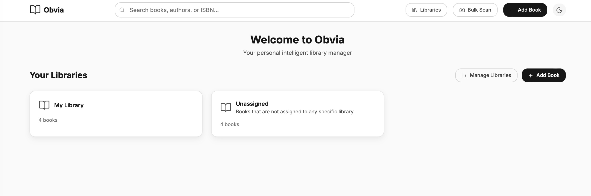

# Preposition

Preposition is a personal intelligent library manager designed for readers of non-fiction.  
It helps you **seamlessly take notes, connect context, and use AI to enhance understanding**.  

## Brand Meaning & Connotation
The name **Preposition** comes from grammar — prepositions are words like *in, on, with, about* that **connect ideas and give them context**.  
That's exactly what Preposition does: it connects your **books, notes, and ideas** to reveal deeper relationships.  

- 📖 **For readers:** It bridges the gap between what you read and how you remember it.  
- ✍️ **For thinkers:** It turns highlights and notes into connected insights.  
- 🤖 **With AI:** It helps you model concepts, generate new ideas, and communicate with greater clarity.  

In short:  
👉 **Preposition is the space between reading and understanding.**

[](https://opensource.org/licenses/MIT)
[](https://www.python.org/downloads/)
[](https://www.djangoproject.com/)
[](https://reactjs.org/)
[](https://docs.docker.com/compose/)

A modern, self-hosted personal library management system with intelligent book discovery, semantic search, and AI-powered note-taking capabilities.



## ✨ Features

### 📚 **Book Management**
- **ISBN Lookup & Barcode Scanning**: Add books instantly via ISBN lookup or live webcam barcode scanning
- **Bulk Import**: Scan multiple books rapidly with audio feedback and real-time progress tracking
- **Metadata Enrichment**: Automatic data fetching from Google Books and Open Library APIs
- **Cover Management**: Upload and manage book cover images with automatic resizing

### 🔍 **Advanced Search & Discovery**
- **Semantic Search**: AI-powered search across book metadata, notes, and PDF content
- **Basic Search**: Fast filtering by title, author, ISBN, tags, ratings, and shelves
- **Smart Recommendations**: Get personalized book recommendations based on your library
- **Full-Text Search**: Search within uploaded PDF documents

### 📝 **Intelligent Notes & Reviews**
- **Markdown Support**: Rich text editing with markdown syntax
- **AI Assistance**: Get AI-powered suggestions for note enhancement
- **Rating System**: Multi-category rating system (overall, plot, writing, etc.)
- **Review Management**: Comprehensive review system with tags and categories

### 🏷️ **Organization & Categorization**
- **Library Management**: Create and manage multiple libraries
- **Shelf System**: Organize books with custom and system shelves (wishlist, reading, finished)
- **Tagging**: Flexible tagging system for book categorization
- **Import/Export**: Bulk import/export libraries in JSON format

### 🎨 **Modern Interface**
- **Responsive Design**: Works seamlessly on desktop, tablet, and mobile
- **Dark/Light Mode**: Toggle between themes for comfortable reading
- **Real-time Updates**: Live updates without page refreshes
- **Accessibility**: Built with accessibility best practices

## 🛠️ Tech Stack

### Backend
- **Python 3.11+** with Django 5.0
- **Django REST Framework** for API development
- **MySQL 8.0** (with SQLite fallback for development)
- **Redis** for caching and session management
- **Celery** for background task processing

### Frontend
- **React 18** with Vite for fast development
- **Tailwind CSS** for modern, responsive styling
- **Axios** for API communication
- **React Router** for client-side routing

### Infrastructure
- **Docker & Docker Compose** for containerization
- **Nginx** for static file serving
- **MinIO** (optional) for object storage

## 🚀 Quick Start

### Prerequisites
- [Docker](https://docs.docker.com/get-docker/) and [Docker Compose](https://docs.docker.com/compose/install/)
- [Git](https://git-scm.com/)

### Installation

1. **Clone the repository**
   ```bash
   git clone https://github.com/yourusername/preposition.git
   cd preposition
   ```

2. **Start the application**
   ```bash
   # Using the development script (recommended)
   ./scripts/dev.sh
   
   # Or manually with Docker Compose
   docker compose up --build
   ```

3. **Access the application**
   - **Frontend**: http://localhost:5173
   - **Backend API**: http://localhost:8000
   - **API Documentation**: http://localhost:8000/api/docs/

### First Time Setup

1. **Create a superuser account**
   ```bash
   docker compose exec backend python manage.py createsuperuser
   ```

2. **Create system shelves**
   ```bash
   docker compose exec backend python manage.py create_system_shelves
   ```

3. **Seed with example books** (optional)
   ```bash
   docker compose exec backend python manage.py seed_books --create-library
   ```

## ⚙️ Configuration

### Environment Variables

Copy `.env.example` to `.env` and configure the following variables:

```bash
# Database Configuration
MYSQL_HOST=localhost
MYSQL_PORT=3306
MYSQL_DB=preposition
MYSQL_USER=preposition
MYSQL_PASSWORD=preposition

# Django Configuration
SECRET_KEY=your-secret-key-here
DEBUG=true
ALLOWED_HOSTS=localhost,127.0.0.1

# External APIs (Optional)
GOOGLE_BOOKS_ENABLED=true
OPEN_LIBRARY_ENABLED=true
GOOGLE_BOOKS_API_KEY=your-google-books-api-key

# AI Features (Optional)
AI_PROVIDER=disabled  # Options: openai, local, disabled
OPENAI_API_KEY=your-openai-api-key

# Storage
MEDIA_ROOT=/app/media
USE_OBJECT_STORAGE=false
```

### Production Deployment

For production deployment, ensure you:

1. **Set secure environment variables**
   ```bash
   DEBUG=false
   SECRET_KEY=your-very-secure-secret-key
   ALLOWED_HOSTS=your-domain.com,www.your-domain.com
   ```

2. **Use external database**
   ```bash
   MYSQL_HOST=your-db-host
   MYSQL_USER=your-db-user
   MYSQL_PASSWORD=your-db-password
   ```

3. **Configure external storage** (optional)
   ```bash
   USE_OBJECT_STORAGE=true
   # Configure S3 or MinIO credentials
   ```

## 📖 Usage Guide

### Adding Books

1. **Manual Entry**: Use the "Add Book" form to enter book details manually
2. **ISBN Lookup**: Enter an ISBN to automatically fetch book metadata
3. **Barcode Scanning**: Use the bulk scanner for rapid book import

### Bulk Scanning

The bulk scanner allows you to quickly scan multiple books:

1. Navigate to the bulk scanner page
2. Select your target library
3. Start scanning and hold books in front of the camera
4. Monitor progress in the live queue panel
5. Export results as CSV when finished

### Search & Discovery

- **Basic Search**: Use the search bar for quick title/author lookups
- **Advanced Filters**: Filter by tags, ratings, shelves, and more
- **Semantic Search**: Enable AI provider for intelligent content search
- **Recommendations**: Get personalized book suggestions

### File Management

- **PDF Upload**: Upload book PDFs for text extraction
- **Cover Images**: Manage book cover images with automatic resizing
- **File Organization**: Organize files by book and library

## 🔧 Development

### Local Development Setup

1. **Backend Development**
   ```bash
   cd backend
   python -m venv venv
   source venv/bin/activate  # On Windows: venv\Scripts\activate
   pip install -r requirements.txt
   python manage.py runserver
   ```

2. **Frontend Development**
   ```bash
   cd frontend
   npm install
   npm run dev
   ```

### Running Tests

```bash
# Backend tests
docker compose exec backend python manage.py test --settings=preposition_core.test_settings

# Frontend tests
cd frontend && npm test
```

### Database Management

```bash
# Apply migrations
docker compose exec backend python manage.py migrate

# Create superuser
docker compose exec backend python manage.py createsuperuser

# Reset database
docker compose down -v
docker compose up --build
```

## 📚 API Documentation

The API provides comprehensive endpoints for all functionality:

### Core Endpoints
- `GET /api/books/` - List all books
- `POST /api/books/ingest/` - Create book from ISBN
- `GET /api/libraries/` - List all libraries
- `GET /api/search/basic` - Basic search with filters
- `POST /api/search/semantic` - Semantic search

### Authentication
The API uses Django's built-in authentication system. For production, consider implementing JWT tokens.

### Rate Limiting
API endpoints are rate-limited to prevent abuse. Adjust limits in settings for production use.

## 🤝 Contributing

We welcome contributions! Please see our [Contributing Guidelines](CONTRIBUTING.md) for details.

### Development Workflow

1. Fork the repository
2. Create a feature branch (`git checkout -b feature/amazing-feature`)
3. Commit your changes (`git commit -m 'Add amazing feature'`)
4. Push to the branch (`git push origin feature/amazing-feature`)
5. Open a Pull Request

### Code Style

- **Python**: Follow PEP 8 guidelines
- **JavaScript**: Use ESLint configuration
- **CSS**: Follow Tailwind CSS conventions
- **Commits**: Use conventional commit messages

## 🐛 Bug Reports

Please use the [GitHub issue tracker](https://github.com/yourusername/preposition/issues) to report bugs. Include:

- Clear description of the issue
- Steps to reproduce
- Expected vs actual behavior
- Environment details (OS, browser, etc.)

## 🔒 Security

### Security Model

- **Local Storage**: All data is stored locally by default
- **No External Sharing**: Data is never shared with third parties
- **Secure Defaults**: Production-ready security configurations
- **Regular Updates**: Dependencies are regularly updated

### Reporting Security Issues

If you discover a security vulnerability, please report it privately to [security@yourdomain.com](mailto:security@yourdomain.com) before creating a public issue.

### Security Best Practices

1. **Change Default Credentials**: Always change default database passwords
2. **Use HTTPS**: Configure SSL/TLS for production deployments
3. **Regular Backups**: Set up automated backup procedures
4. **Keep Updated**: Regularly update dependencies and the application

## 📄 License

This project is licensed under the MIT License - see the [LICENSE](LICENSE) file for details.

## 🙏 Acknowledgments

- **Google Books API** for book metadata
- **Open Library API** for additional book information
- **OpenAI** for AI-powered features
- **Django** and **React** communities for excellent documentation

## 📞 Support

- **Documentation**: [Wiki](https://github.com/yourusername/preposition/wiki)
- **Issues**: [GitHub Issues](https://github.com/yourusername/preposition/issues)
- **Discussions**: [GitHub Discussions](https://github.com/yourusername/preposition/discussions)
- **Email**: [support@yourdomain.com](mailto:support@yourdomain.com)

## 📈 Roadmap

- [ ] **Mobile App**: Native iOS and Android applications
- [ ] **Multi-User**: Multi-user support
- [ ] **Social Features**: Share libraries and book recommendations
- [ ] **Advanced Analytics**: Reading statistics and insights
- [ ] **Improved Book Recommendations**: Improved book recommendations
- [ ] **Integration APIs**: Connect with other book services
- [ ] **Offline Mode**: Full offline functionality
- [ ] **Multi-language Support**: Internationalization
- [ ] **AI-powered book discovery**: AI-powered book discovery

---